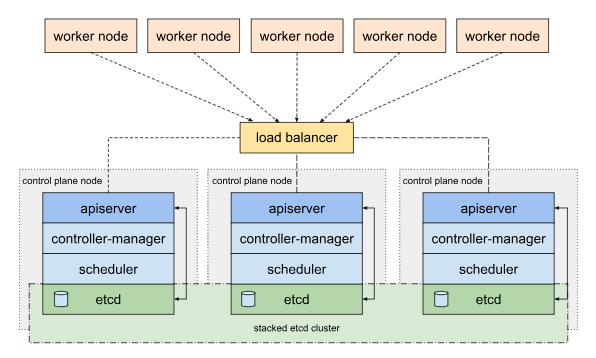
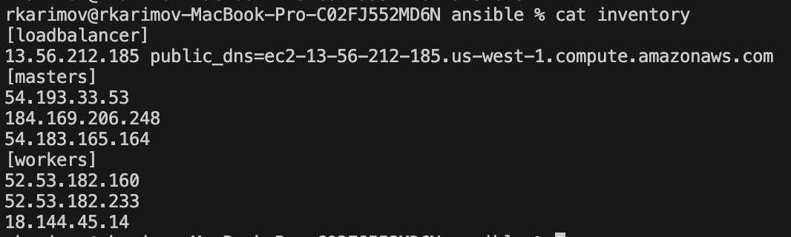
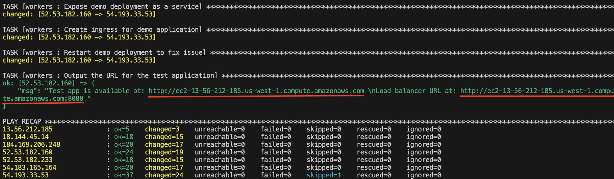
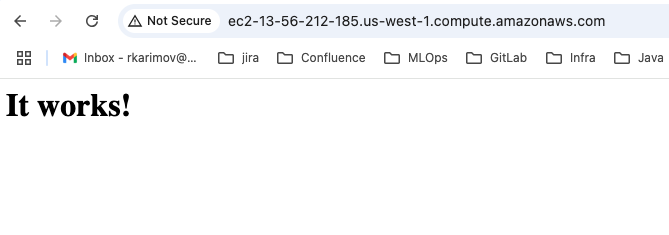
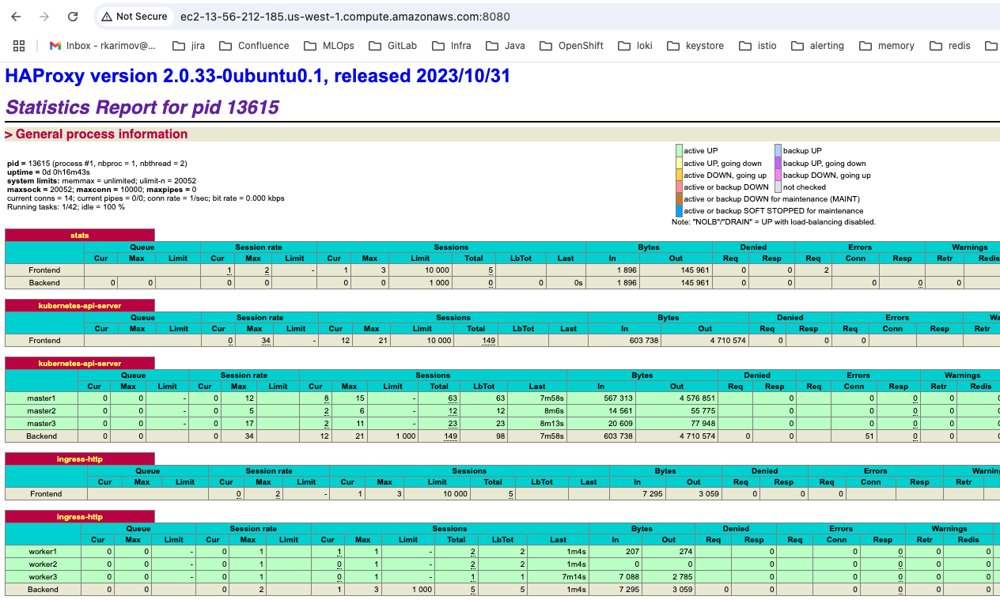
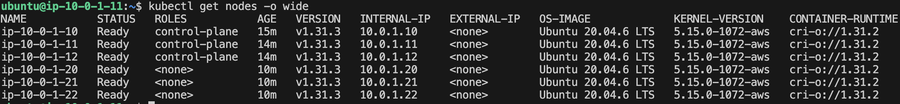

# Kubernetes Installer

## Overview

This repository provides a streamlined approach to deploying a Kubernetes cluster using Ansible. It supports on-premises servers and, in the "Quick Start" section, provides an example using AWS EC2 instances for quick testing and development. 

Architecture:

## Quick Start

Tools Required:
~~~
- Terraform (for testing on AWS)
- Ansible
~~~

### Install VMs on AWS
Ensure AWS credentials are set in your environment:
~~~
export AWS_ACCESS_KEY_ID=<aws_access_key_id>
export AWS_SECRET_ACCESS_KEY=<aws_secret_access_key>
~~~

Use Terraform to provision EC2 instances(Ubuntu was tested in this example). The Terraform script will automatically populate the ansible/inventory file with the public IPs of the created instances.
~~~
git clone https://github.com/rasulkarimov/kubernetes-installer.git
cd kubernetes-installer/terraform
terraform init
terraform plan
terraform apply
~~~

### Prepare ansible for Kubernetes cluster installation
After running Terraform, check that the ansible/inventory file contains the IP addresses of the created instances:
~~~
cat ../ansible/inventory
~~~

Test SSH Access
Credentials for SSH access defined in ansible.cfg file. 
Confirm that you can connect to the instances using the SSH key generated by Terraform:
~~~
ssh -i ../kubernetes.key ubuntu@54.193.33.53
exit
~~~

Run the Ansible playbook to install the Kubernetes cluster:
~~~
cd ../ansible
ansible-playbook site.yml
~~~

When the installation is complete, a test application will be deployed. Its URL, along with the load balancer's URL, will be provided in the output:

Open the test app URL and confirm that it is available:

When you open the load balancer's URL, you can check the HAProxy statistics and node statuses:

Check Node Status
Log in to the master node and verify that all nodes are up and ready:
~~~
ssh -i kubernetes.key ubuntu@<master_node_ip>
kubectl get nodes -o wide
~~~

Or use kubeconfig.cfg which is copied into ./ansible/kubeconfig.cfg folder on PC duriong kubernees installation process:
~~~
kubectl --kubeconfig=kubeconfig.cfg get nodes -o wide
~~~

### Destroy AWS EC2 Infrastructure
To tear down the testing environment on AWS, use the following command:
~~~
cd ../terraform
terraform destroy
~~~

## For On-Premises Servers
- **OS**: Ensure that servers are provisioned with distributions based on Debian or Red Hat. PXE (Preboot Execution Environment) can be configured in the data center to automate provisioning.
- **Network**: Ensure that the network interface is configured with a static IP address. Additional customizations can be applied using your scripts according to your specific site/app requirements.
- **Load Balancer**: The Ansible roles are designed to check if a [loadbalancer] is defined in the inventory file. If provided, the HAProxy load balancer will be configured and used in the Kubernetes bootstrapping process; otherwise, Kubernetes will be deployed without a load balancer. Additionally, if "public_dns" is provided for the load balancer host, a test application will be deployed and exposed using this "public_dns". For production environments, a wildcard DNS can point to the load balancer, allowing applications with the format *.<load_balancer_dns_name> to be handled by the on-premises Kubernetes cluster.

The "kubernetes-installer" follows the official Kubernetes installation instructions with kubeadm tool. For troubleshooting and detailed setup procedures, refer to the official Kubernetes documentation: [Kubernetes Setup Docs](https://kubernetes.io/docs/setup/production-environment/tools/kubeadm/create-cluster-kubeadm/).