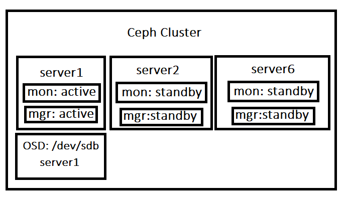
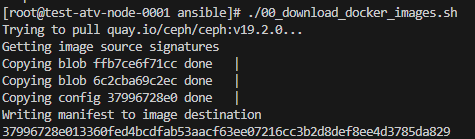
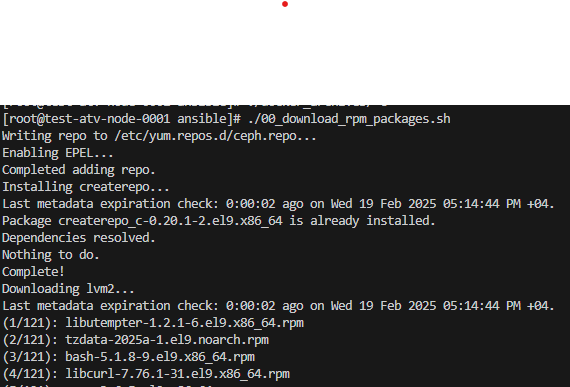
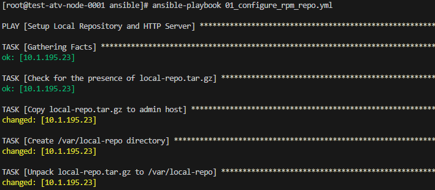

# Ceph Installer

## Overview

This repository provides a streamlined approach to deploying a Ceph cluster using Ansible. It supports on-premises servers and, in the "Quick Start" section, provides an example which was tested with CentOS 9 operating system (Rocky Linux 9). 

Architecture:



## Quick Start

### Installing a Ceph Cluster in a Private Datacenter

**Prerequsits**
* git 
* ansible
* podman

Other tools will be deployed with ansible.

For installing a Ceph cluster without internet access, you need to configure a private repository. Follow these steps:


### Configure Ansible User with Sudo Access

To remotely manage nodes, the Ansible user must be able to log into all nodes with root privileges to install software and create configuration files without prompting for a password.

**Clone the Repository**:
   - Use Git to clone the required repository.

   ```bash
   git clone https://github.com/rasulkarimov/ceph-installer.git
   ```

**Review Ansible Configuration (ansible.cfg)**:

Ensure that the Ansible configuration is set up with the appropriate credentials. Define the remote user and their credentials, ensuring that the user is able to connect to all hosts and perform sudo operations without requiring a password.
~~~
[defaults]
remote_user = presight-sa
inventory = ./inventory
private_key_file = ~/.ssh/id_rsa
[privilege_escalation]
become = True
become_method = sudo
become_user = root
become_ask_pass = False
~~~

**Fill inventory file with your hosts**

~~~
[admin]
10.1.195.23
[docker_registry]
10.1.195.23
[loadbalncer]
10.1.195.23
[ceph]
10.1.195.23
10.1.215.183
10.1.132.204
~~~
n the admin host, the Ceph cluster will be bootstrapped, and an RPM repository source will be created, allowing all hosts to refer to it for package installations within the network without requiring internet access. Additionally, a local registry will be installed, and all required Docker images will be pushed to this registry. Details about this process will be covered later.

For the load balancer group, HAProxy will be installed to expose the Ceph Dashboard from the host where the MGR service is active.

**Review group variables in group_vars/site.yml**
In variables can be customized installation process. For example if site has access to public internet then tot needed to install private docker registry, this step can be disabled in variables file, then registry will not be installed and cluster during bootstraping will download images from official public repositoryes from internet.
"deploy_private_rpm_repository: false" - will configure hosts to download ceph packages from public ceph repos.
~~~
# day one 
deploy_private_docker_registry: true
loadbalancer_enabled: true
deploy_private_rpm_repository: true
ntp_server_source: time.google.com # when NTP server source provided, it will be configured during validate-install step
ceph_version: 19.2.0
cluster_network: 10.1.0.0/16 # define for internal cluster traffic

# day two configureation
create_default_storage_on_all_devices: false
create_default_mds: false
~~~

**Prepare required packages for internet disconnected installation**
For an internet-disconnected installation, you we to prepare the appropriate Docker images and RPM files. In the Git repository with Ansible playbooks, two shell scripts are provided to download the required packages for installation from the internet. Run these scripts from a machine with internet access. Then, place them in the same location during the Ansible installation; if provided in the same location where they were downloaded by the script, Ansible will add them to the local RPM repository and Docker registries.
Make sure that CEPH_VERSION variable defined in shell scripts match with ceph_version defined in group_vars/site.sh file.
Download docker images:
~~~
./00_download_docker_images.sh
~~~


Download RPMs:
~~~
./00_download_rpm_packages.sh
~~~


**Bootstrap the cluster**
When all prerequisits compleated we can run site.yml playbook which will complete installation for us. 
~~~
ansible-playbook site.yml
~~~

When cluster is install link for the Dashboard url will be provided, with default credentials. During first login you will be forced to update password for admin user. 


**Step by step explanation**
While the main.yml allows for the installation of the entire cluster, we will now go step-by-step to provide more details about the installation flow. 
The 01_configure_rpm_repo.yml playbook configures local RPM repositories for all servers. Based on the variables defined in group vars, either a local repository on the admin node or public repositories will be configured. For local repo installation 00_download_rpm_packages.sh have to be compleated before.


Install Private Registry
Steps to configure the private registry and bootstrap the first Ceph cluster:

Review Inventory File:

Check the inventory file to ensure it lists all relevant nodes.
~~~
cat ../ansible/inventory
~~~

Inventory Example

Bootstrap the Cluster:
~~~
~~~

Start setting up the cluster with Ceph.
~~~
ceph -s
~~~
Add Nodes to the Cluster:

Use Ansible playbooks to add additional nodes to your cluster.
~~~
ansible-playbook site.yml
~~~

Configure HAProxy for Ceph Dashboard Exposure:
Ensure that HAProxy is configured to expose the Ceph Dashboard.
~~~
ansible-playbook configure-haproxy.yml
~~~

Upon completion, a link to the Ceph Dashboard URL will be provided.

Useful Commands
Manage Ceph cluster hosts and labels, deploy daemons, and monitor OSDs using the following commands:

Add Host Labels:
~~~
ceph orch host label add HOSTNAME LABEL
~~~
List Hosts and Labels:
~~~
ceph orch host ls
~~~
Deploy Daemons Using Labels:
~~~
ceph orch apply mon label:mon
~~~
Or specify host placement:
~~~
ceph orch apply mon --placement="3 host01 host02 host03"
~~~
List Storage Devices:
~~~
ceph orch device ls
~~~
Create New OSDs:
~~~
ceph orch daemon add osd <host>:<device-path>
~~~
Or deploy on all available devices:
~~~
ceph orch apply osd --all-available-devices
~~~
Monitor OSD:
~~~
ceph orch osd rm status
~~~
Clean Devices:
~~~
ceph orch device zap <host> /dev/vdb --force
~~~

TODO
Add instructions to create an RPM repository, providing guidance on repository setup and management for Ceph.