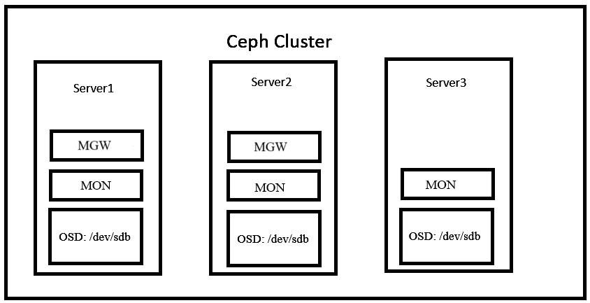
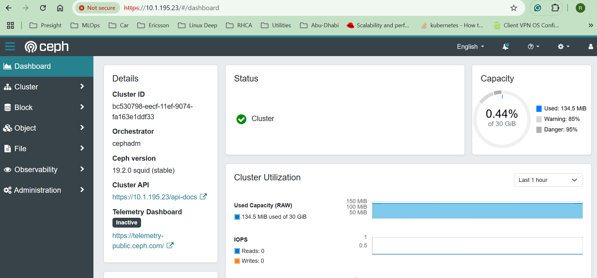

# Ceph Installer

## Overview

This repository provides a streamlined approach to deploying a Ceph cluster using Ansible. It supports on-premises servers and, in the "Quick Start" section, provides an example which was tested with CentOS 9 operating system (Rocky Linux 9). 

Basic Ceph Storage Cluster Architecture Overview:



## Quick Start

**Prerequsits**
* git 
* ansible
* podman

Additional tools will be deployed using Ansible.

**Configure User**

To remotely manage nodes, the Ansible user must be able to log into all nodes with root privileges to install software and create configuration files without prompting for a password.
~~~
USER_NAME=presight
USER_PASSWD=<passwd>
adduser $USER_NAME
cat << EOF >/etc/sudoers.d/$USER_NAME
$USER_NAME ALL = (root) NOPASSWD:ALL
EOF
echo "$USER_NAME:$USER_PASSWD" | sudo chpasswd
ssh-keygen
ssh-copy-id <all hosts>
~~~

Use Git to clone this repository:

   ```bash
   git clone https://github.com/rasulkarimov/ceph-installer.git
   ```

**Review Ansible Configuration in ansible.cfg**:

Ensure that the Ansible configuration is set up with the appropriate credentials. Define the remote user and their credentials, ensuring that the user is able to connect to all hosts and perform sudo operations without requiring a password.
~~~
[defaults]
remote_user = presight-sa
inventory = ./inventory
private_key_file = ~/.ssh/id_rsa
[privilege_escalation]
become = True
become_method = sudo
become_user = root
become_ask_pass = False
~~~

**Fill inventory file with hosts**
~~~
[admin]
10.1.195.23
[docker_registry]
10.1.195.23
[loadbalncer]
10.1.195.23
[ceph]
10.1.195.23
10.1.215.183
10.1.132.204
~~~
On the admin host, the Ceph cluster will be bootstrapped, and an RPM repository source will be created, allowing all hosts to refer to it for package installations within the network without requiring internet access.
Additionally, a local registry will be installed, and all required Docker images will be pushed to this registry. Details about this process will be covered later.

For the load balancer group, HAProxy will be installed to expose the Ceph Dashboard from the host where the MGR service is active.

**Review group variables in group_vars/all.yml**

~~~
# day one 
deploy_private_docker_registry: true
loadbalancer_enabled: true
deploy_private_rpm_repository: true
ntp_server_source: time.google.com # when NTP server source provided, it will be configured during validate-install step
ceph_version: 19.2.0
cluster_network: 10.1.0.0/16 # define for internal cluster traffic

# day two configureation
create_default_storage_on_all_devices: false
create_default_mds: false
~~~
Installation behavior can be customized through group_var variables. For example, if site has access to the public internet, there is no need to install a private Docker registry. This step can be disabled in the variables file, meaning the registry will not be installed, and the cluster will download images from official public repositories on the internet during bootstrapping.

Setting deploy_private_rpm_repository: false will configure hosts to download Ceph packages from public Ceph repositories.

**Prepare required packages for internet disconnected installation**

For an internet-disconnected installation, we need to prepare the appropriate Docker images and RPM files. In the Git repository with Ansible playbooks, two shell scripts are provided to download the required packages for installation from the internet. Run these scripts from a machine with internet access. Then, place them in the location with Ansible playbooks during the installation; if provided in the same location where they were downloaded by the script, Ansible will automatically add them to the local RPM repository and Docker registries.
Make sure that CEPH_VERSION variable defined in shell scripts match with ceph_version defined in group_vars/all.yml 

Download docker images:
~~~
./00_download_docker_images.sh 
Trying to pull quay.io/ceph/ceph:v19.2.0...
...
~~~

When the script is completed, ensure that the Docker images are saved in the ./docker_archives/ directory:
~~~
ls -l docker_archives/
total 2096664
-rw-r--r-- 1 presight presight   66556416 Feb 19 18:03 alertmanager_v0.25.0.tar
-rw-r--r-- 1 presight presight 1303678464 Feb 19 18:02 ceph_v19.2.0.tar
-rw-r--r-- 1 presight presight  438046720 Feb 19 18:03 grafana_10.4.0.tar
-rw-r--r-- 1 presight presight   23867904 Feb 19 18:03 node-exporter_v1.7.0.tar
-rw-r--r-- 1 presight presight  262765056 Feb 19 18:03 prometheus_v2.51.0.tar
-rw-r--r-- 1 presight presight   26022912 Feb 19 18:03 registry_2.8.3.tar
-rw-r--r-- 1 presight presight   26022912 Feb 19 18:03 registry_2.tar
~~~

Download RPMs:
~~~
./00_download_rpm_packages.sh
...
~~~

All packages with their dependencies have been downloaded and saved in the local-repo.tar.gz file, which will be used during the configuration of the RPM repository.
~~~
ls -l local-repo.tar.gz 
-rw-r--r-- 1 presight presight 219333732 Feb 19 18:09 local-repo.tar.gz
~~~

## Install Ceph cluster

When all prerequisits compleated we can run main.yml playbook which will complete full Ceph cluster installation for us. 
~~~
ansible-playbook main.yml
~~~

When cluster is install link for the Dashboard url will be provided, with default credentials. During first login we will be forced to update password for admin user.




### Step by step explanation

While the installation of the entire cluster is facilitated by main.yml, detailed information about the installation flow is provided here

**01_configure_rpm_repo.yml**

This playbook configures local RPM repositories for all servers. Based on the variables defined in group vars, either a local repository on the admin node or public repositories will be configured. For local repo installation 00_download_rpm_packages.sh have to be compleated before. 


It is also advisable to configure the local default repositories from the Linux base image, which can be mounted, and a repository can be configured for that mount. The repository created by Ansible can be used for reference. For more information, [refer here](https://upspir.com/setting-up-a-local-yum-repository/).

**02_hosts_predeploy_config.yml**

Once the RPM repository is configured, we can check and install all required packages and complete configuration prerequisites on all hosts. The Chrony server will be configured in this step according to variables provided in group_vars.

**03_deploy_docker_registry.yml**

In this steps local private docker registry will be installed. All *.tar images from ./docker_archives/ directory will be pushed into this docker registry. 00_download_docker_images.sh has to be compleated before, to download and save all required RPMs. If internet access allowed, and local registry deployment disabled in group_vars, this step will be skipped. 

**04_bootstrap_cluster.yml**

In this step, the initial cluster will be bootstrapped on the admin node. 

**05_add_hosts.yml**

All remaining hosts will be added into cluster. cephadmin orchestrator automatically will scale deamonds depending number of nodes. cephadm will automatically add up to five monitors to the subnet, as needed, as new hosts are added to the cluster.

**06_deploy_haproxy.yml**

In a Ceph cluster with multiple ceph-mgr instances, only the dashboard running on the currently active ceph-mgr daemon will serve incoming requests. This step will install a proxy that automatically forwards incoming requests to the active ceph-mgr instance.


### Useful Commands
Once the Ceph cluster with core components is deployed, the cluster can be configured according requirements, and other nodes can be added according to the architectural plan for the site. With the first two playbooks, additional hosts can be preconfigured, and then they can be manually joined into the cluster by specifying service labels. Services/daemons are then configured to be placed on those hosts according to their labels. 
Below provided some useful commmands, for more information please refer to official [documentation](https://docs.ceph.com/en/squid/cephadm/host-management/).

Add Labels to Hosts:
~~~
ceph orch host label add HOSTNAME LABEL
~~~
List Hosts and their labels:
~~~
ceph orch host ls
~~~
Deploy Daemons Using Labels:
~~~
ceph orch apply mon label:mon
~~~
Or specify host placement:
~~~
ceph orch apply mon --placement="3 host01 host02 host03"
~~~
List Storage Devices:
~~~
ceph orch device ls
~~~
Create New OSDs on device:
~~~
ceph orch daemon add osd <host>:<device-path>
~~~
Or deploy OSDs on all available devices:
~~~
ceph orch apply osd --all-available-devices
~~~
Monitor OSD:
~~~
ceph orch osd rm status
~~~
Clean Devices:
~~~
ceph orch device zap <host> /dev/vdb --force
~~~

Create a CephFS volume named "cephfs".
The Ceph Orchestrator will automatically create and configure MDS.
~~~
ceph fs volume create cephfs [--placement="3 host01 host02 host03"]
~~~

Mounting CephFS:
~~~
mkdir -p -m 755 /etc/ceph
ssh presight@10.1.195.23 "sudo ceph config generate-minimal-conf" | sudo tee /etc/ceph/ceph.conf
chmod 644 /etc/ceph/ceph.conf
ssh presight@10.1.195.23 "sudo ceph fs authorize cephfs client.foo / rw" | sudo tee /etc/ceph/ceph.client.foo.keyring
chmod 600 /etc/ceph/ceph.client.foo.keyring
cat /etc/ceph/ceph.client.admin.keyring
ceph fs ls
ceph fsid
mount -t ceph admin@bc530798-eecf-11ef-9074-fa163e1ddf33.cephfs=/ /mnt/mycephfs -o secret=AQDT7bVn1bcNABAAcZb8jKd8DQBptfVIjcUkng==
~~~